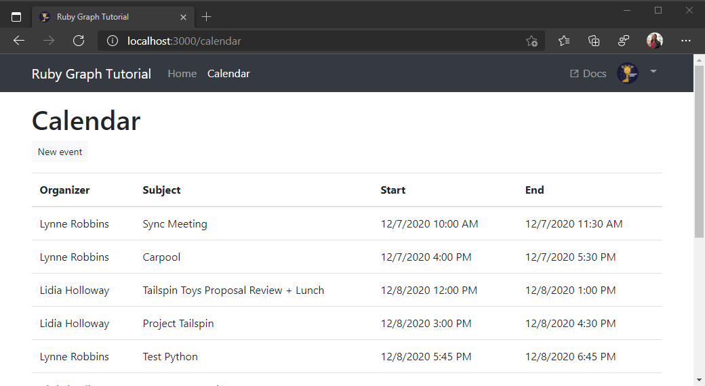

<!-- markdownlint-disable MD002 MD041 -->

В этом упражнении вы добавите Microsoft Graph в приложение. Для этого приложения вы будете использовать драгоценный камень [хттпарти](https://github.com/jnunemaker/httparty) для совершения звонков в Microsoft Graph.

## <a name="create-a-graph-helper"></a>Создание модуля поддержки Graph

1. Создайте вспомогательный объект для управления всеми вызовами API. Выполните следующую команду в командной панели CLI, чтобы создать помощника.

    ```Shell
    rails generate helper Graph
    ```

1. Откройте **./апп/хелперс/graph_helper. RB** и замените его содержимое приведенным ниже содержимым.

    ```ruby
    require 'httparty'

    # Graph API helper methods
    module GraphHelper
      GRAPH_HOST = 'https://graph.microsoft.com'.freeze

      def make_api_call(endpoint, token, params = nil)
        headers = {
          Authorization: "Bearer #{token}"
        }

        query = params || {}

        HTTParty.get "#{GRAPH_HOST}#{endpoint}",
                     headers: headers,
                     query: query
      end
    end
    ```

Уделите время, чтобы узнать, что делает этот код. Он выполняет простой запрос GET через `httparty` драгоценный камень через драгоценный камень в запрашиваемую конечную точку. Он отправляет маркер доступа в `Authorization` заголовке и включает все переданные параметры запроса.

Например, чтобы использовать `make_api_call` метод для получения `https://graph.microsoft.com/v1.0/me?$select=displayName`, можно вызвать его следующим образом:

```ruby
make_api_call `/v1.0/me`, access_token, { '$select': 'displayName' }
```

Вы создадите это позднее при реализации дополнительных функций Microsoft Graph в приложении.

## <a name="get-calendar-events-from-outlook"></a>Получение событий календаря из Outlook

1. Чтобы добавить новый контроллер, в интерфейсе командной строки выполните следующую команду.

    ```Shell
    rails generate controller Calendar index
    ```

1. Добавьте новый маршрут в **./конфиг/раутес.РБ**.

    ```ruby
    get 'calendar', to: 'calendar#index'
    ```

1. Добавьте новый метод в модуль поддержки графов, чтобы получить [список событий пользователя](/graph/api/user-list-events?view=graph-rest-1.0). Откройте **./апп/хелперс/graph_helper. RB** и добавьте в `GraphHelper` модуль следующий метод.

    :::code language="ruby" source="../demo/graph-tutorial/app/helpers/graph_helper.rb" id="GetCalendarSnippet":::

    Рассмотрите, что делает этот код.

    - URL-адрес, который будет вызываться — это `/v1.0/me/events`.
    - `$select` Параметр позволяет ограничить поля, возвращаемые для каждого события, только теми, которые используются нашим представлением.
    - `$orderby` Параметр сортирует результаты по дате и времени создания, начиная с самого последнего элемента.
    - Для успешного ответа он возвращает массив элементов, содержащийся в `value` ключе.

1. Откройте **./апп/контроллерс/calendar_controller. RB** и замените все его содержимое на приведенный ниже код.

    ```ruby
    # Calendar controller
    class CalendarController < ApplicationController
      include GraphHelper

      def index
        @events = get_calendar_events access_token || []
        render json: @events
      rescue RuntimeError => e
        @errors = [
          {
            message: 'Microsoft Graph returned an error getting events.',
            debug: e
          }
        ]
      end
    end
    ```

1. Перезапустите сервер. Войдите и щелкните ссылку **Календарь** на панели навигации. Если все работает, вы должны увидеть дамп событий JSON в календаре пользователя.

## <a name="display-the-results"></a>Отображение результатов

Теперь можно добавить HTML-код для отображения результатов более удобным для пользователя способом.

1. Откройте **/АПП/виевс/календар/индекс.хтмл.ЕРБ** и замените его содержимое приведенным ниже.

    :::code language="html" source="../demo/graph-tutorial/app/views/calendar/index.html.erb" id="CalendarSnippet":::

    Это приведет к перебору коллекции событий и добавлению строки таблицы для каждой из них.

1. Удалите `render json: @events` строку из `index` действия в файле **./АПП/контроллерс/calendar_controller. RB**.

1. Обновите страницу, после чего приложение должно отобразить таблицу событий.

    
