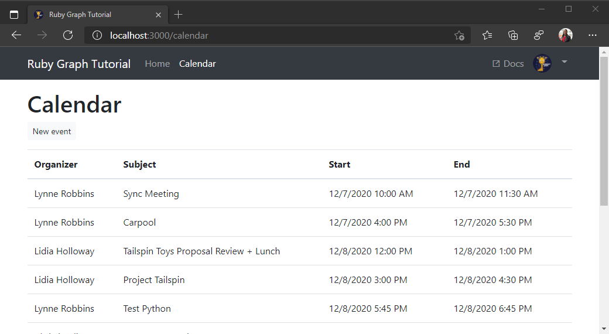

<!-- markdownlint-disable MD002 MD041 -->

<span data-ttu-id="9171d-101">В этом упражнении вы добавите Microsoft Graph в приложение.</span><span class="sxs-lookup"><span data-stu-id="9171d-101">In this exercise you will incorporate the Microsoft Graph into the application.</span></span> <span data-ttu-id="9171d-102">Для этого приложения вы будете использовать драгоценный камень [хттпарти](https://github.com/jnunemaker/httparty) для совершения звонков в Microsoft Graph.</span><span class="sxs-lookup"><span data-stu-id="9171d-102">For this application, you will use the [httparty](https://github.com/jnunemaker/httparty) gem to make calls to Microsoft Graph.</span></span>

## <a name="create-a-graph-helper"></a><span data-ttu-id="9171d-103">Создание модуля поддержки Graph</span><span class="sxs-lookup"><span data-stu-id="9171d-103">Create a Graph helper</span></span>

<span data-ttu-id="9171d-104">Создайте вспомогательный объект для управления всеми вызовами API.</span><span class="sxs-lookup"><span data-stu-id="9171d-104">Create a helper to manage all of your API calls.</span></span> <span data-ttu-id="9171d-105">Выполните следующую команду в командной панели CLI, чтобы создать помощника.</span><span class="sxs-lookup"><span data-stu-id="9171d-105">Run the following command in your CLI to generate the helper.</span></span>

```Shell
rails generate helper Graph
```

<span data-ttu-id="9171d-106">Откройте созданный `./app/helpers/graph_helper.rb` файл и замените его содержимое приведенным ниже.</span><span class="sxs-lookup"><span data-stu-id="9171d-106">Open the newly created `./app/helpers/graph_helper.rb` file and replace the contents with the following.</span></span>

```ruby
require 'httparty'

# Graph API helper methods
module GraphHelper
  GRAPH_HOST = 'https://graph.microsoft.com'.freeze

  def make_api_call(endpoint, token, params = nil)
    headers = {
      Authorization: "Bearer #{token}"
    }

    query = params || {}

    HTTParty.get "#{GRAPH_HOST}#{endpoint}",
                 headers: headers,
                 query: query
  end
end
```

<span data-ttu-id="9171d-107">Уделите время, чтобы узнать, что делает этот код.</span><span class="sxs-lookup"><span data-stu-id="9171d-107">Take a moment to review what this code does.</span></span> <span data-ttu-id="9171d-108">Он выполняет простой запрос GET через `httparty` драгоценный камень через драгоценный камень в запрашиваемую конечную точку.</span><span class="sxs-lookup"><span data-stu-id="9171d-108">It makes a simple GET request via the `httparty` gem to the requested endpoint.</span></span> <span data-ttu-id="9171d-109">Он отправляет маркер доступа в `Authorization` заголовке и включает все переданные параметры запроса.</span><span class="sxs-lookup"><span data-stu-id="9171d-109">It sends the access token in the `Authorization` header, and it includes any query parameters that are passed.</span></span>

<span data-ttu-id="9171d-110">Например, чтобы использовать `make_api_call` метод для получения `https://graph.microsoft.com/v1.0/me?$select=displayName`, можно вызвать его следующим образом:</span><span class="sxs-lookup"><span data-stu-id="9171d-110">For example, to use the `make_api_call` method to do a GET to `https://graph.microsoft.com/v1.0/me?$select=displayName`, you could call it like so:</span></span>

```ruby
make_api_call `/v1.0/me`, access_token, { '$select': 'displayName' }
```

<span data-ttu-id="9171d-111">Вы создадите это позднее при реализации дополнительных функций Microsoft Graph в приложении.</span><span class="sxs-lookup"><span data-stu-id="9171d-111">You'll build on this later as you implement more Microsoft Graph features into the app.</span></span>

## <a name="get-calendar-events-from-outlook"></a><span data-ttu-id="9171d-112">Получение событий календаря из Outlook</span><span class="sxs-lookup"><span data-stu-id="9171d-112">Get calendar events from Outlook</span></span>

<span data-ttu-id="9171d-113">Для начала добавим возможность просмотра событий в календаре пользователя.</span><span class="sxs-lookup"><span data-stu-id="9171d-113">Let's start by adding the ability to view events on the user's calendar.</span></span> <span data-ttu-id="9171d-114">Чтобы добавить новый контроллер, в интерфейсе командной строки выполните следующую команду.</span><span class="sxs-lookup"><span data-stu-id="9171d-114">In your CLI, run the following command to add a new controller.</span></span>

```Shell
rails generate controller Calendar index
```

<span data-ttu-id="9171d-115">Теперь, когда у нас есть доступный маршрут, обновите ссылку на **Календарь** в панели `./app/view/layouts/application.html.erb` навигации, чтобы использовать ее.</span><span class="sxs-lookup"><span data-stu-id="9171d-115">Now that we have the route available, update the **Calendar** link in the navbar in `./app/view/layouts/application.html.erb` to use it.</span></span> <span data-ttu-id="9171d-116">Замените строку на `<a class="nav-link" href="#">Calendar</a>` приведенную ниже строку.</span><span class="sxs-lookup"><span data-stu-id="9171d-116">Replace the line `<a class="nav-link" href="#">Calendar</a>` with the following.</span></span>

```html
<%= link_to "Calendar", {:controller => :calendar, :action => :index}, class: "nav-link#{' active' if controller.controller_name == 'calendar'}" %>
```

<span data-ttu-id="9171d-117">Добавьте новый метод в модуль поддержки графов, чтобы получить [список событий пользователя](https://developer.microsoft.com/en-us/graph/docs/api-reference/v1.0/api/user_list_events).</span><span class="sxs-lookup"><span data-stu-id="9171d-117">Add a new method to the Graph helper to [list the user's events](https://developer.microsoft.com/en-us/graph/docs/api-reference/v1.0/api/user_list_events).</span></span> <span data-ttu-id="9171d-118">Откройте `./app/helpers/graph_helper.rb` следующий метод в `GraphHelper` модуле и добавьте к нему следующий метод.</span><span class="sxs-lookup"><span data-stu-id="9171d-118">Open `./app/helpers/graph_helper.rb` and add the following method to the `GraphHelper` module.</span></span>

```ruby
def get_calendar_events(token)
  get_events_url = '/v1.0/me/events'

  query = {
    '$select': 'subject,organizer,start,end',
    '$orderby': 'createdDateTime DESC'
  }

  response = make_api_call get_events_url, token, query

  raise response.parsed_response.to_s || "Request returned #{response.code}" unless response.code == 200
  response.parsed_response['value']
end
```

<span data-ttu-id="9171d-119">РасСмотрите, что делает этот код.</span><span class="sxs-lookup"><span data-stu-id="9171d-119">Consider what this code is doing.</span></span>

- <span data-ttu-id="9171d-120">URL-адрес, который будет вызываться — это `/v1.0/me/events`.</span><span class="sxs-lookup"><span data-stu-id="9171d-120">The URL that will be called is `/v1.0/me/events`.</span></span>
- <span data-ttu-id="9171d-121">`$select` Параметр позволяет ограничить поля, возвращаемые для каждого события, только теми, которые используются нашим представлением.</span><span class="sxs-lookup"><span data-stu-id="9171d-121">The `$select` parameter limits the fields returned for each events to just those our view will actually use.</span></span>
- <span data-ttu-id="9171d-122">`$orderby` Параметр сортирует результаты по дате и времени создания, начиная с самого последнего элемента.</span><span class="sxs-lookup"><span data-stu-id="9171d-122">The `$orderby` parameter sorts the results by the date and time they were created, with the most recent item being first.</span></span>
- <span data-ttu-id="9171d-123">Для успешного ответа он возвращает массив элементов, содержащийся в `value` ключе.</span><span class="sxs-lookup"><span data-stu-id="9171d-123">For a successful response, it returns the array of items contained in the `value` key.</span></span>

<span data-ttu-id="9171d-124">Теперь вы можете протестировать это.</span><span class="sxs-lookup"><span data-stu-id="9171d-124">Now you can test this.</span></span> <span data-ttu-id="9171d-125">Откройте `./app/controllers/calendar_controller.rb` и обновите `index` действие, чтобы вызвать этот метод и отобразить результаты.</span><span class="sxs-lookup"><span data-stu-id="9171d-125">Open `./app/controllers/calendar_controller.rb` and update the `index` action to call this method and render the results.</span></span>

```ruby
# Calendar controller
class CalendarController < ApplicationController
  include GraphHelper

  def index
    @events = get_calendar_events access_token || []
    render json: @events
  rescue RuntimeError => e
    @errors = [
      {
        message: 'Microsoft Graph returned an error getting events.',
        debug: e
      }
    ]
  end
end
```

<span data-ttu-id="9171d-126">Перезапустите сервер.</span><span class="sxs-lookup"><span data-stu-id="9171d-126">Restart the server.</span></span> <span data-ttu-id="9171d-127">Войдите и щелкните ссылку **Календарь** на панели навигации.</span><span class="sxs-lookup"><span data-stu-id="9171d-127">Sign in and click the **Calendar** link in the nav bar.</span></span> <span data-ttu-id="9171d-128">Если все работает, вы должны увидеть дамп событий JSON в календаре пользователя.</span><span class="sxs-lookup"><span data-stu-id="9171d-128">If everything works, you should see a JSON dump of events on the user's calendar.</span></span>

## <a name="display-the-results"></a><span data-ttu-id="9171d-129">Отображение результатов</span><span class="sxs-lookup"><span data-stu-id="9171d-129">Display the results</span></span>

<span data-ttu-id="9171d-130">Теперь вы можете добавить HTML и CSS для отображения результатов более удобным для пользователя способом.</span><span class="sxs-lookup"><span data-stu-id="9171d-130">Now you can add HTML and CSS to display the results in a more user-friendly manner.</span></span>

<span data-ttu-id="9171d-131">Откройте `./app/views/calendar/index.html.erb` и замените его содержимое приведенным ниже.</span><span class="sxs-lookup"><span data-stu-id="9171d-131">Open `./app/views/calendar/index.html.erb` and replace its contents with the following.</span></span>

```html
<h1>Calendar</h1>
<table class="table">
  <thead>
    <tr>
      <th scope="col">Organizer</th>
      <th scope="col">Subject</th>
      <th scope="col">Start</th>
      <th scope="col">End</th>
    </tr>
  </thead>
  <tbody>
    <% @events.each do |event| %>
      <tr>
        <td><%= event['organizer']['emailAddress']['name'] %></td>
        <td><%= event['subject'] %></td>
        <td><%= event['start']['dateTime'].to_time(:utc).localtime.strftime('%-m/%-d/%y %l:%M %p') %></td>
        <td><%= event['end']['dateTime'].to_time(:utc).localtime.strftime('%-m/%-d/%y %l:%M %p') %></td>
      </tr>
    <% end %>
  </tbody>
</table>
```

<span data-ttu-id="9171d-132">Это приведет к перебору коллекции событий и добавлению строки таблицы для каждой из них.</span><span class="sxs-lookup"><span data-stu-id="9171d-132">That will loop through a collection of events and add a table row for each one.</span></span> <span data-ttu-id="9171d-133">Удаление `render json: @events` строки из `index` действия в `./app/controllers/calendar_controller.rb` и приложение теперь отображает таблицу событий.</span><span class="sxs-lookup"><span data-stu-id="9171d-133">Remove the `render json: @events` line from the `index` action in `./app/controllers/calendar_controller.rb` and the app should now render a table of events.</span></span>

